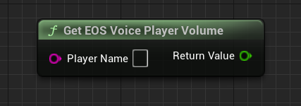
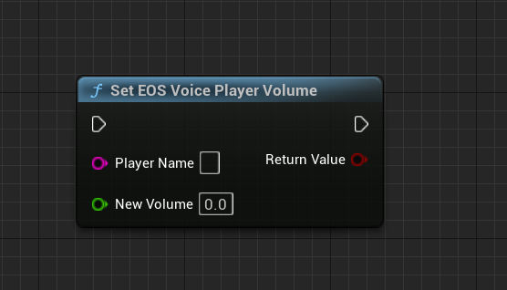
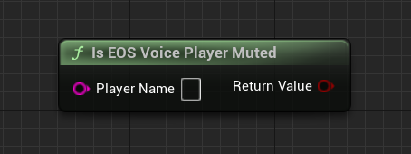
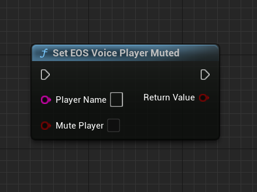
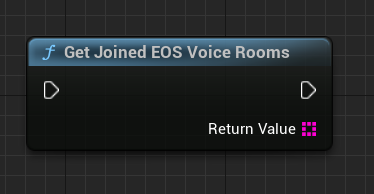
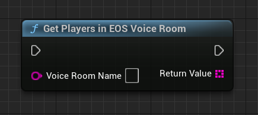
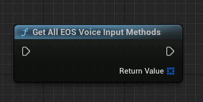
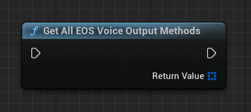
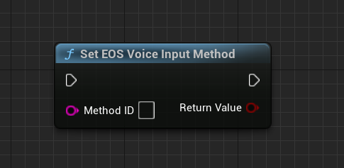
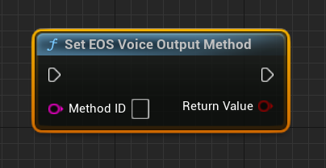

:::sample { #container1 }
This method is called `Obvious Method` because although EOS team states it as a trusted server login, most games would likely be more likely to use this method for Listen Servers too.
:::

So, what is Obvious Method? It is a method where the client sends the user credentials to the server and the server creates a token and sends it back to the client for them to conenct to the voice channel. This method is used for both Dedicated Servers and Listen Servers. The only difference is that in Dedicated Servers, the server is the one that verifies the credentials with the EOS backend, while in Listen Servers, the client is the one that verifies the credentials with the EOS backend.

## Code Setup
!!!light Just a small info...
This code doesn't require the players to require to login using EOS Methods. You can use voice chat functions with or without doing other EOS Login Setup.
!!!

`Voice Room Name` - The name of the voice room that you want to join. For instance, if you have a game similar to Pubg or Fortnite, where there are 100 players with teams of 4, then you can have 25 voice rooms with 4 players each. This will allow you to have a voice room for each team.

`Player Name` - The name of the player that you want to join the voice room with. This is the name that will be displayed in the voice room.

`Client IP` - The IP of the client. You can use **10.0.0.1** as the default value if you don't want to pass the IP. If you pass the IP, EOS will connect you to nearest available voice server.
[!embed](https://blueprintue.com/render/6kplwrq8/)

## Voice Functions

EIK provides you with a set of functions that you can use utilize to have better Voice Chat in your game. These functions are:

### Get Player Volume

This function is used to get the volume of the player. This function takes in the following parameters:

`Player Name` - The name of the player that you used to join the voice room.

### Set Player Volume

This function is used to set the volume of the player. This function takes in the following parameters:

!!!danger
EOS has a bug where the volume can be set only at 0, 100 and 200. We have workaround for this bug which will be shown later.
!!!
`Player Name` - The name of the player that you used to join the voice room.

`New Volume` - The new volume of the player. This value should be between 0 and 200.

### Get Player Muted

This function is used to get whether the player is muted or not. This function takes in the following parameters:

`Player Name` - The name of the player that you used to join the voice room.

### Set Player Muted

This function is used to set whether the player is muted or not. This function takes in the following parameters:

`Player Name` - The name of the player that you used to join the voice room.

`Mute Player` - Whether the player should be muted or not. This value should be either `True` (Player should be muted) or `False` (Player should not be muted) 

### Get Joined Room Names

!!!info 📢 Some good info
This means that you can join multiple rooms at the same time. This is useful if you want to have a team voice chat and a global voice chat at the same time.
!!!
This function is used to get the names of the rooms that the player has joined. This function takes no input parameters.

### Get Joined Room Players

This function is used to get the names of the players that have joined the room. This function takes in the following parameters:

`Room Name` - The name of the room that you want to get the players of.

This will return an array of players that have joined the room with their names you used to login them into the voice chat.

### Get Available Input Methods

This function is used to get the available input methods that the player can use. This function takes no input parameters.

You can break the returned array to get the available input methods with their `ID` and `Display Name`.

### Get Available Output Methods

This function is used to get the available output methods that the player can use. This function takes no input parameters.

You can break the returned array to get the available output methods with their `ID` and `Display Name`.

### Set Input Method

This function is used to set the input method of the player. This function takes in the following parameters:

`Method ID` - The ID of the method that you want to set as the input method which can be taken from the `Get Available Input Methods` function.

### Set Output Method

This function is used to set the output method of the player. This function takes in the following parameters:

`Method ID` - The ID of the method that you want to set as the output method which can be taken from the `Get Available Output Methods` function.

